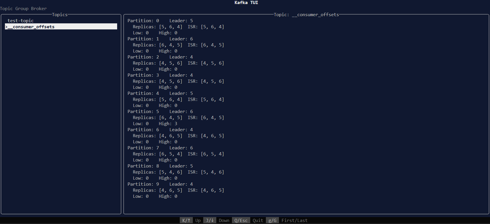

# kata

developing...

A terminal user interface for Kafka, built with [ratatui](https://github.com/ratatui-org/ratatui).



## Features

- Display Kafka topic list
- View topic details
- Receive and send messages

## Quick Start

To quickly get up and running with this project, use the following command:

```bash
cargo run --bin kata -- --brokers <brokers> --group <group>
```